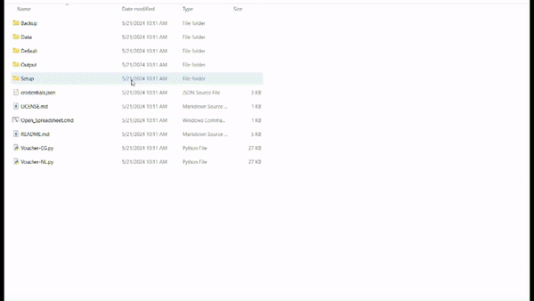
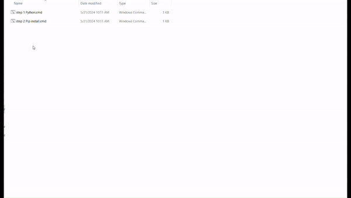
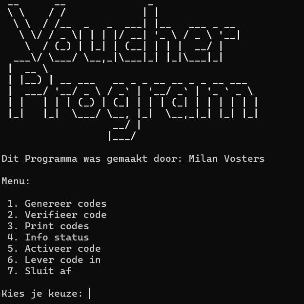
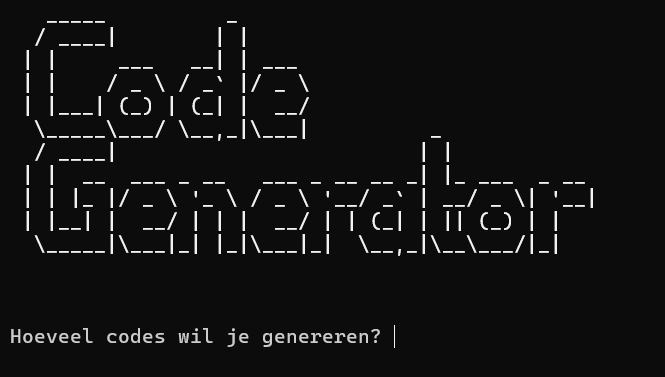
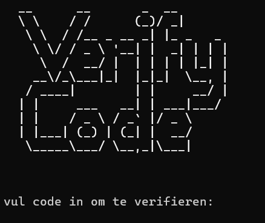
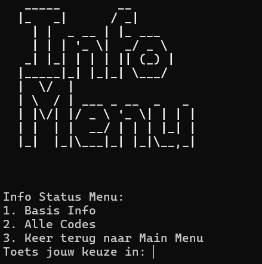
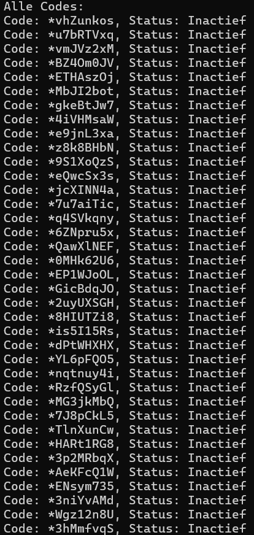
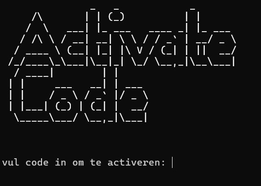
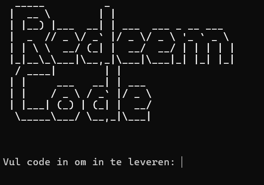

# Voucher Code Generator and Coupon Maker

Deze repository bevat een Python-script dat unieke vouchercodes genereert, opslaat als barcodes en hun status beheert (bijv. activatie, inwisseling). Het integreert ook met Google Sheets voor het opslaan en beheren van de vouchercodes.

Dit script is uitsluitend bedoeld voor medewerkers van Fietsstation en de eigenaar.

## Inhoudsopgave

- [Vereisten](#vereisten)
- [Installatie](#installatie)
- [Installatie App](#installatie-app)
- [Gebruik](#gebruik)
- [Hoofdmenu](#hoofdmenu)
   - [Optie 1](#optie-1)
   - [Optie 2](#optie-2)
   - [Optie 3](#optie-3)
   - [Optie 4](#optie-4)
     - [Optie 4.1](#optie-41)
     - [Optie 4.2](#optie-42)
   - [Optie 5](#optie-5)
   - [Optie 6](#optie-6)
   - [Optie 7](#optie-7)
- [Outputbestand](#outputbestand)
- [Standaardmap](#standaardmap)
- [Spreadsheettoegang](#spreadsheettoegang)
- [Functies](#functies)
- [Errors](#errors)
- [Contact](#contact)

## Vereisten

Voordat je begint, zorg ervoor dat je aan de volgende vereisten voldoet:

- Internettoegang om de Google Sheets API te gebruiken.

## Installatie

1. Download het zip-bestand van de repository.
2. Pak het zip-bestand uit naar een gewenste locatie op je computer.
3. Open de uitgepakte map en voer de setup-map uit.
4. Volg de stappen in de map:

    - **Stap 1**: Installatie van Python  
      Open het bestand genaamd `step 1 Python.cmd`. Als Windows zegt dat het bestand onveilig is, klik op *Meer info/More info* en daarna op *Run*. 
      
      
    - **Stap 2**: Installatie van de vereiste pakketten  
      Open het bestand genaamd `step 2 Pip install.cmd`. Dit installeert alle modules; je hoeft niets te doen terwijl dit loopt. Het kan tot 2 minuten duren. Ook dit script kan voor de eerste keer zeggen dat het bestand onveilig is. Doe hetzelfde om hier omheen te komen als bij stap 1. 
      

    Je hoeft geen `credentials.json` bestand te plaatsen; dit is al inbegrepen in de download.

## Installatie App

1. Download [Qpython](https://play.google.com/store/apps/details?id=org.qpython.qpy&pcampaignid=web_share) of [Python3](https://play.google.com/store/apps/details?id=ru.iiec.pydroid3&pcampaignid=web_share) voor Android.
2. Open het `requirements_app.txt` bestand en kopieer de inhoud.
3. Open de terminal in de Python app en plak de inhoud.
4. Wanneer de vereisten zijn geïnstalleerd, open het `app(pre-release).py` bestand en voer het uit.

## Gebruik

Klik op het `voucher.py` bestand om het script te starten.

Je zult 2 versies zien: `Voucher-EG.py` en `Voucher-NL.py`. `Voucher-EG.py` is de Engelse versie en `Voucher-NL.py` is de Nederlandse versie. Je kunt zelf kiezen welke je wilt gebruiken.

Het script zal je een menu presenteren om verschillende bewerkingen uit te voeren, zoals het genereren van codes, het controleren van de geldigheid van een code, het afdrukken van codes, het bekijken van informatie, het activeren en inwisselen van codes.

## Hoofdmenu

### Menu
Dit is wat je ziet wanneer je het programma start. 

### Optie 1
- **Code Generator/Code Genarator**
Met deze optie kun je codes genereren in het spreadsheet `Open_spreadsheet.cmd`. Je kunt een aantal invoeren en deze zullen binnen 10 seconden worden gegenereerd. 

### Optie 2
- **Code Verifiëren/Verify Code**
Met deze optie kun je een code van een klant of `Open_spreadsheet.cmd` pakken en controleren of hij geldig is en wat de status is. 

### Optie 3
- **Print/Printen**
Met deze optie worden er **36** random ongeactiveerde codes gevonden en op een blaadje met de coupons als barcode geplaatst. 
Dit is een voorbeeld: [Coupon_List.pdf](https://github.com/BeginstationMilan/Voucher-Program/files/15388530/Coupon_List.pdf) 

Als de maat niet klopt of er is iets fout, ga naar [Contact](#contact) onderaan en stuur een email.

### Optie 4
- **Info Menu**
Dit is een mini-menu voor info. 

#### Optie 4.1
- **Basis Info**
Dit geeft een lijst van het volgende: 
  - `Totaal aantal codes` = Aantal codes 
  - `Actieve codes` = Aantal actieve codes 
  - `Inactieve codes` = Aantal inactieve codes 
  - `Geprinte codes` = Aantal geprinte codes 
  - `Gebruikte codes` = Aantal gebruikte codes 
  - `Programma gemaakt door: Milan Vosters` = Info over maker 
  - `Project gestart op: 08:00AM 16/5/2024` = Info over project 

#### Optie 4.2
- **Alle Codes**
Dit laat alle codes zien en hun status. 

### Optie 5
- **Code Activeren/Activate Code**
Deze optie is om een code te activeren. Dit doe je wanneer je een klant een coupon gaat geven. Anders kunnen ze het niet inleveren. Nadat je het hebt geactiveerd, zet je een vinkje op geactiveerd op de coupon. 

### Optie 6
- **Code Inleveren/Redeem Code**
Deze optie is om een code in te leveren van een klant. Dit maakt de code ongeldig en dan krijgt de klant 10% korting. 

### Optie 7
- **Sluit Af/Exit**
Dit sluit het programma af. 

## Outputbestand

De gegenereerde coupons en barcodes worden opgeslagen in een output-bestand. Dit bestand bevat alle uitkomsten van het script, zoals de gegenereerde barcodes en coupons. Zorg ervoor dat je de locatie van dit bestand noteert, zodat je eenvoudig toegang hebt tot de opgeslagen gegevens.

## Standaardmap

De map genaamd `Default` bevat alle standaardontwerpen die het script nodig heeft om de coupons en barcodes te maken. Zorg ervoor dat deze map aanwezig is in de hoofdmap van het project, omdat het script anders niet correct zal functioneren.

## Spreadsheettoegang

In de hoofdmap van de uitgepakte bestanden bevindt zich een bestand genaamd `Open_spreadsheet.cmd`. Dit bestand opent een link naar de Google Spreadsheet die alle informatie en codes bevat. Door dit bestand uit te voeren, krijg je eenvoudig toegang tot de spreadsheet waar je de status en details van alle vouchercodes kunt beheren.

## Functies

### `clear_screen()`
Maakt het terminalscherm leeg.

### `loading_bar(action, *args)`
Toont een laadbalk tijdens het uitvoeren van de opgegeven actie.

### `generate_unique_code()`
Genereert een unieke alfanumerieke code.

### `generate_barcode(code, filename)`
Genereert een barcode-afbeelding voor de opgegeven code.

### `get_credentials(credentials_file_path=None)`
Haalt Google Sheets API-referenties op.

### `add_to_google_sheet(num_codes, credentials_file_path=CREDENTIALS_FILE_PATH)`
Genereert en voegt unieke codes toe aan een Google Sheet.

### `activate_code(code, credentials_file_path=None)`
Activeert een opgegeven code in de Google Sheet.

### `check_code_validity(code, credentials_file_path=CREDENTIALS_FILE_PATH)`
Controleert de geldigheid en status van een opgegeven code.

### `print_image_in_portrait(file_path)`
Drukt een afbeeldingsbestand af in portretmodus.

### `save_coupon(code)`
Genereert een couponafbeelding met de opgegeven code en barcode.

### `make_printed()`
Markeert geselecteerde niet-geprinte codes als geprint en genereert een PDF van de coupons.

### `find_random_unprinted_code(credentials_file_path=None)`
Zoekt een willekeurige niet-geprinte code uit de Google Sheet.

### `mark_as_printed(code, credentials_file_path=CREDENTIALS_FILE_PATH)`
Markeert een opgegeven code als geprint in de Google Sheet.

### `print_images_in_windows(file_paths)`
Drukt afbeeldingen af met de standaardprinter op Windows.

### `info_status()`
Toont het statusmenu voor verschillende informatie over codes.

### `show_basic_info()`
Toont basisinformatie over de gegenereerde codes.

### `show_all_codes()`
Toont alle gegenereerde codes en hun status.

### `redeem_code(code, credentials_file_path=CREDENTIALS_FILE_PATH)`
Markeert een opgegeven code als ingewisseld in de Google Sheet.

### `redeem_code_with_credentials(code, credentials)`
Markeert een opgegeven code als ingewisseld met de gegeven credentials.

### `main_menu()`
Toont het hoofdmenu van het programma.

## Errors

- **Fout bij het genereren van een barcode**: Controleer of de `Default` map aanwezig is in de hoofdmap en of de barcode bibliotheek correct is geïnstalleerd.
- **Google Sheets API-fout**: Zorg ervoor dat de Google Sheets API-referenties correct zijn en dat er internettoegang is.
- **Printerfout**: Controleer of de printer correct is aangesloten en ingesteld op je systeem.

## Contact

Als je vragen hebt of tegen problemen aanloopt, neem dan contact op met:

- **Naam**: Milan Vosters
- **Email**: [email@example.com](mailto:m.vosters@beginstation.nl)
- **Website**: [Beginstation](https://www.beginstation.nl)

---

